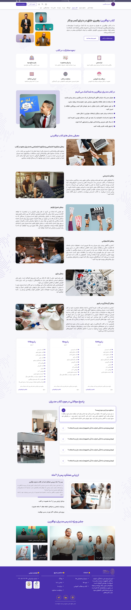
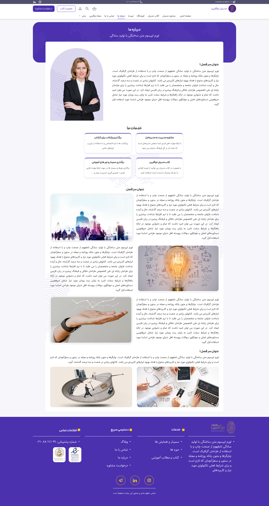
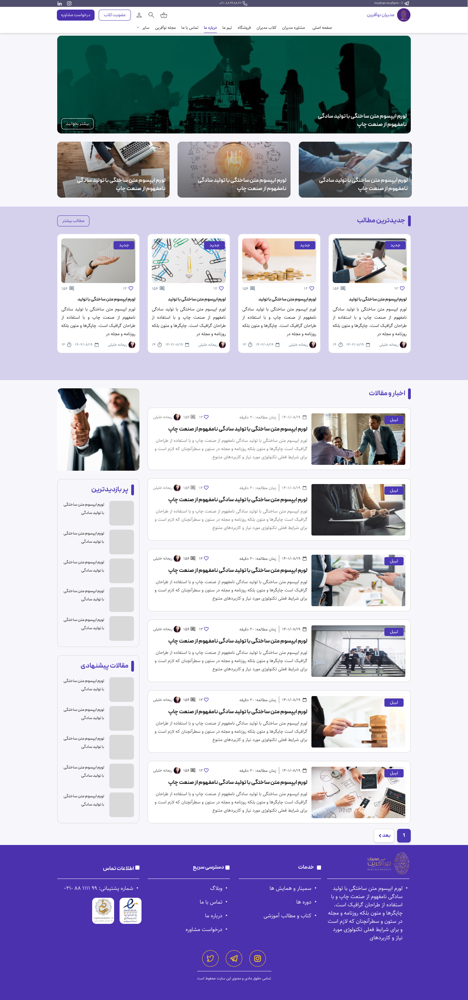

Modiranenoafarin Website

  
    

  
    

Overview

Modiran E Noafarin is a corporate website developed with WordPress and WooCommerce to present the company’s services, products, and educational content through a modern and responsive online platform.

⸻

Technologies Used

* WordPress
* Elementor
* WooCommerce
* HTML5
* CSS3
* JavaScript

⸻

My Role

I was responsible for the complete implementation and front-end development of the website based on the provided UI design.

Responsibilities included:

* Full website implementation using WordPress and Elementor
* WooCommerce setup and customization
* Responsive development for desktop, tablet, and mobile devices
* Front-end customization using HTML, CSS, and JavaScript
* Layout implementation across all pages
* Cross-device testing and optimization
* Website content structure implementation

⸻

Key Features

* Fully responsive design
* WooCommerce integration
* Mobile-friendly user experience
* Custom front-end styling
* Optimized layouts for different screen sizes
* Service and content presentation pages
* Contact and inquiry forms

⸻

Project Highlights

* Complete website implementation from provided UI design
* Responsive development for all major screen sizes
* WooCommerce configuration and customization
* HTML, CSS, and JavaScript enhancements
* Cross-browser and mobile optimization

⸻

Notes

The UI/UX design was provided by the client/design team. My role focused on website development, implementation, customization, responsive execution, and WooCommerce integration using WordPress, Elementor, HTML, CSS, and JavaScript.
